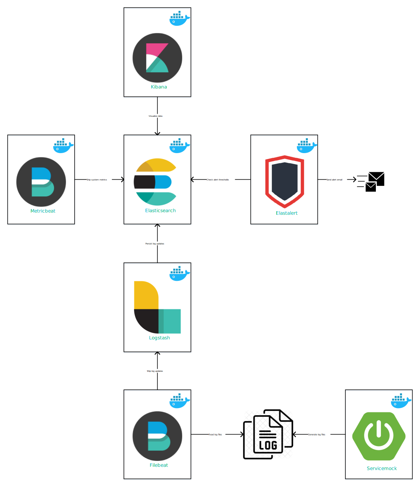
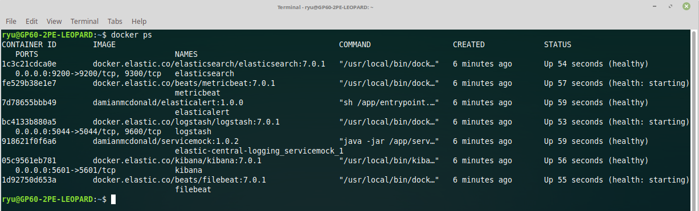
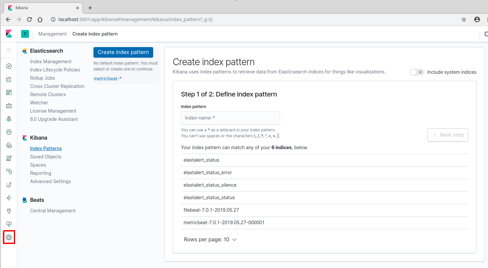
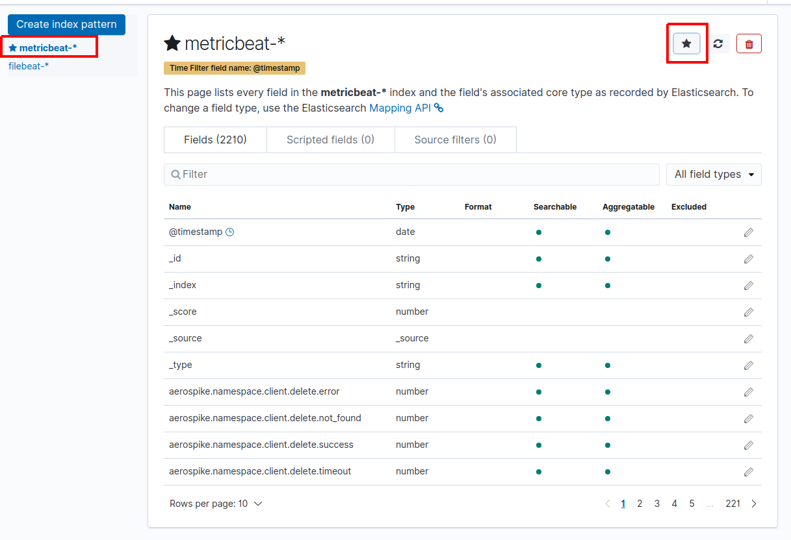
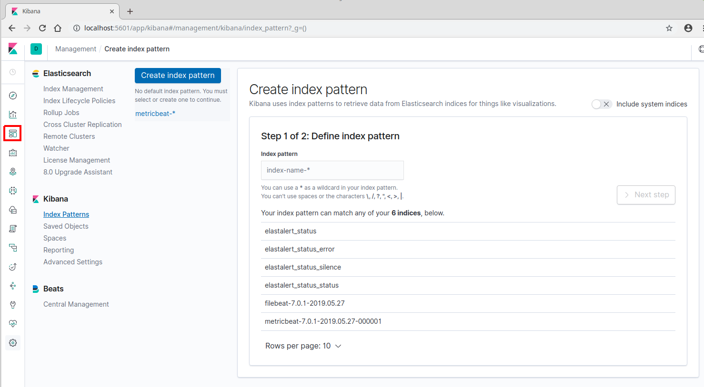
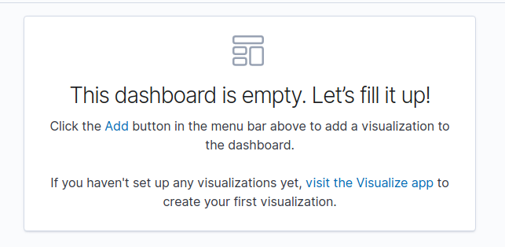
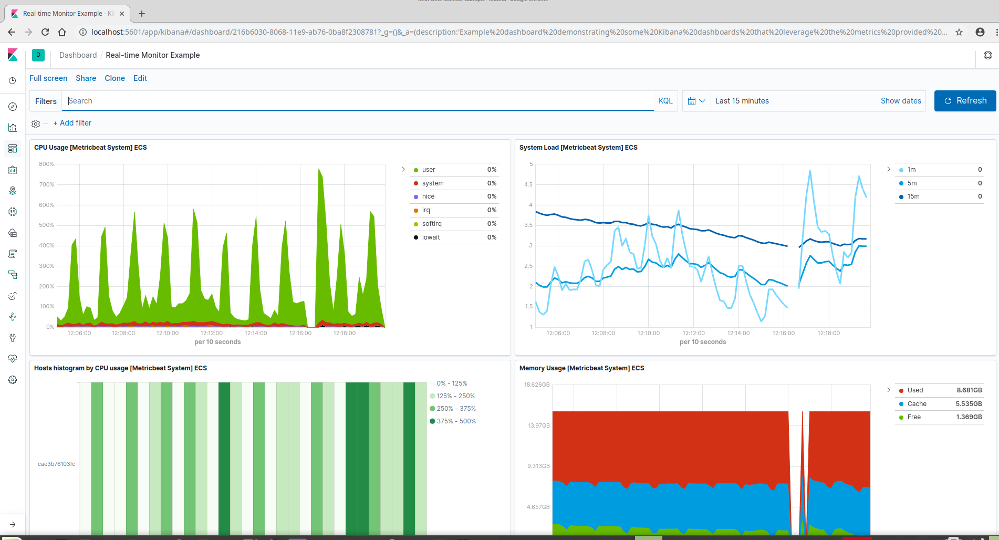

# Overview
`elastic-central-logging` is an example project that demonstrates the use of the [Elastic Stack](https://www.elastic.co/products/) to provide central logging functionality.

The project leverages [Docker](https://www.docker.com/) technology to deliver a containerized Elastic Stack, orchestrated using [Docker Compose](https://docs.docker.com/compose/).

To simulate a *real world* usage of the Elastic Stack, Yelp's [elastalert](https://github.com/Yelp/elastalert) is included to apply alerting thresholds to the aggregated logging data. If a threshold is breached, elastalert will send an alert email (using a dummy SMTP server, [FakeSMTP](http://nilhcem.com/FakeSMTP/)).

# Project Architecture

"A picture paints a thousand words" - so here is a visual representation of the project architecture.



## Components
`elastic-central-logging` is composed of the following components which are deployed within component specific Docker containers.

| Component | Description |
| ------------- | ------------- |
| [Elasticsearch](https://www.elastic.co/products/elasticsearch) | A distributed, RESTful search and analytics engine capable of solving a growing number of use cases. The heart of the Elastic Stack. |
| [Kibana](https://www.elastic.co/products/kibana) | Kibana lets you visualize your Elasticsearch data and navigate the Elastic Stack. |
| [Logstash](https://www.elastic.co/products/logstash) | Logstash is an open source, server-side data processing pipeline that ingests data from a multitude of sources simultaneously, transforms it, and then sends it to Elasticsearch. |
| [Filebeat](https://www.elastic.co/products/beats/filebeat) | Filebeat offers a lightweight way to forward and centralize logs and files. |
| [Metricbeat](https://www.elastic.co/products/beats/metricbeat) | Collects metrics from your systems and services. From CPU to memory, Redis to NGINX, and much more, Metricbeat is a lightweight way to send system and service statistics. |
| [Elasticalerts](https://github.com/damianmcdonald/elastic-alerts) | ElasticAlerts uses the [Yelp elastalert](https://github.com/Yelp/elastalert) framework for alerting on anomalies, spikes, or other patterns of interest from data in Elasticsearch. |
| [Servicemock](https://github.com/damianmcdonald/servicemock) | A Spring Boot application that generates multiple log files with random log data with different log levels and exceptions. |

## Process flow
The process flow of the project can be described as follows:

 1. `Servicemock` component generates log files. These log files are generated in the [servicemock/logs](servicemock/logs) directory. 3 separate log files are generated with the following format;
* *env.SERVICEMOCK_NAME-ENGLISH-$HOSTNAME.log*
* *env.SERVICEMOCK_NAME-ESPERANTO-$HOSTNAME.log*
* *env.SERVICEMOCK_NAME-LATIN-$HOSTNAME.log*

2. `Filebeat` component monitors the log files in the [servicemock/logs](servicemock/logs) directory and ships any new updates contained within the logs to the `logstash` component.

3. `logstash` component injects the log file data provided by the `filebeat` component and *stashes* (persists) the data in the `elasticsearch` component.

4. `metricbeat` component gathers system metric data (CPU usage, RAM usage, Disk I/O etc) and ships the data directly to the `elasticsearch` component.

5. `elasticsearch` component is the heart of the Elastic Stack and the *Source of Truth* for the `elastic-central-logging` project. This component is the endpoint to which all data in the project is stored.

6. `Kibana` component is used to visualize the data stored in the `elasticsearch` component.

7. `elasticalert` component is used to execute rules against the `elasticsearch` component. If any of these rules are violated then the `elasticalert` component sends an email alert notification.

# Getting started

The first step in getting started with the `elastic-central-logging` project is to grab the source code.

```bash
git clone --progress --verbose https://github.com/damianmcdonald/elastic-central-logging.git elastic-central-logging
```
## Prerequisites

### Hardware

With the source code downloaded, the next step is to ensure that the target system meets the minimum prerequisites.

From a hardware specifications perspective, the minimum requirements to run the project are:

* 64-bit system
* Processor: 1 gigahertz (GHz) or faster processor
* RAM: 16 gigabyte (GB) 64-bit
* Disk: 20 GB free space

### Software

At a minimum, the following software is required to support the execution of the `elastic-central-logging` project.

* [Docker](https://www.docker.com/) version 18+
* [Docker Compose](https://docs.docker.com/compose/) version 1.24+
* [OpenJDK](https://openjdk.java.net/) version 1.8+
* [FakeSMTP](http://nilhcem.github.com/FakeSMTP/downloads/fakeSMTP-latest.zip) latest

* Windows and Mac users get [Docker Compose](https://docs.docker.com/compose/) installed automatically with [Docker](https://www.docker.com/) for Windows/Mac.
* Linux users can read the [install instructions](https://docs.docker.com/compose/install/#install-compose) or can install via pip:
```bash
pip install docker-compose
```

* Windows Users must set the following 2 ENV vars:
 * `COMPOSE_CONVERT_WINDOWS_PATHS=1`
 * `PWD=/path/to/checkout/for/stack-docker`
  * for example: `/c/Users/myusername/elastic/stack-docker`
  * Note: your paths must be in the form of `/c/path/to/place` using `C:\path\to\place` will not work
 * You can set these three ways:
   1. Temporarily add an env var in powershell use: `$Env:COMPOSE_CONVERT_WINDOWS_PATHS=1`
   2. Permanently add an env var in powershell use: `[Environment]::SetEnvironmentVariable("COMPOSE_CONVERT_WINDOWS_PATHS", "1", "Machine")`
   > Note: you will need to refresh or create a new powershell for this env var to take effect
   3. in System Properties add the environment variables.

* At least 8GiB of RAM for the containers. Windows and Mac users _must_
configure their Docker virtual machine to have more than the default 2 GiB of
RAM:


* Linux Users must set the following configuration as `root`:
```bash
sysctl -w vm.max_map_count=262144
```

By default, the amount of Virtual Memory [is not enough](https://www.elastic.co/guide/en/elasticsearch/reference/current/vm-max-map-count.html).

An [example prerequisite installation script](docs/assets/scripts/install.sh) is provided that has been tested to work on a clean Ubuntu 18.04 instance.

```bash
# global variables
DEVEL_DIR=/opt/devel
DISTRIB_DIR=/opt/devel/distrib
SOURCE_DIR=/opt/devel/source
TOOLS_DIR=/opt/devel/tools
FAKESMTP_BINARY_URL="http://nilhcem.github.com/FakeSMTP/downloads/fakeSMTP-latest.zip"
FAKESMTP_BINARY_FILE=fakeSMTP-latest.zip
FAKESMTP_EXTRACTED_DIR=fakeSMTP-2.0.jar

# create base directories
sudo mkdir -p $DEVEL_DIR
sudo mkdir -p $DISTRIB_DIR
sudo mkdir -p $SOURCE_DIR
sudo mkdir -p $TOOLS_DIR

sudo chown -R ${USER} $DEVEL_DIR
sudo chgrp -R ${USER} $DEVEL_DIR
sudo chmod -R 775 $DEVEL_DIR

# prepare ubuntu
sudo apt update
sudo apt -y upgrade
sudo apt -y dist-upgrade

# install pre-requisites
sudo apt -y install python3 unzip build-essential dkms linux-headers-$(uname -r) apt-transport-https ca-certificates curl wget software-properties-common openjdk-8-jdk ncftp git

# install and configure docker
curl -fsSL https://download.docker.com/linux/ubuntu/gpg | sudo apt-key add -
sudo add-apt-repository "deb [arch=amd64] https://download.docker.com/linux/ubuntu bionic stable"
sudo apt update
sudo apt -y install docker-ce
sudo usermod -aG docker ${USER}
sudo cp -v /etc/sysctl.conf /etc/sysctl.conf.backup
echo "#### Added to increase memory for Docker" | sudo tee -a /etc/sysctl.conf
echo "vm.max_map_count=262144" | sudo tee -a /etc/sysctl.conf

# install and configure docker-compose
sudo curl -L "https://github.com/docker/compose/releases/download/1.24.0/docker-compose-$(uname -s)-$(uname -m)" -o /usr/local/bin/docker-compose
sudo chmod +x /usr/local/bin/docker-compose

# install fakesmtp
cd $DISTRIB_DIR
wget $FAKESMTP_BINARY_URL
unzip $FAKESMTP_BINARY_FILE
mkdir -p $TOOLS_DIR/fakesmtp
mv -v $DISTRIB_DIR/$FAKESMTP_EXTRACTED_DIR $TOOLS_DIR/fakesmtp/$FAKESMTP_EXTRACTED_DIR
```

## Running the stack
With the prerequisites fulfilled, you are now ready to run the stack.

We will assume that `$PROJECT_ROOT`refers to the directory where you cloned the `elastic-central-logging` project.

1. Run the FakeSMTP server, we will need this to receive the alert emails.
```bash
cd $PROJECT_ROOT/fakesmtp
./run-fakesmtp.sh
```

2. Run the `servicemock` component to start generating log files. The log files will be written to `$PROJECT_ROOT/servicemock/logs`.
```bash
cd $PROJECT_ROOT/servicemock
./run-servicemock.sh
```

3. Spin up the stack using `docker-compose`.
```bash
docker-compose up
```

4. Be patient! The stack will take about 3-5 minutes to be fully operational.

If everything has gone well, you will eventually (make sure to wait between 5-10 minutes) start receiving alert emails into FakeSMTP.

Some URLs that can be accessed to check different elements of the stack:

| URL | Purpose |
| ------------- | ------------- |
| http://localhost:9200 | Base endpoint of Elasticsearch. This URL can be used to check that Elasticsearch is healthy |
| http://localhost:9200/_cat/indices?v&pretty | This endpoint will allow you to check the Elasticsearch indexes. |
| http://localhost:5601 | Base endpoint of Kibana. This URL can be used to visualize the data stored in Elasticsearch |

You can also check the health of the stack by listing the running Docker processes from a terminal.

```bash
docker ps
```

Each running container will list its health status (Healthy or Unhealthy).



# Technical details

Given that the `elastic-central-logging` project is orchestrated using [Docker Compose](https://docs.docker.com/compose/), you can view all the key details of the project by reading the [docker-compose.yml](docker-compose.yml) file.

```yml
version: '3.6'
services:

  elasticsearch:
    image: docker.elastic.co/elasticsearch/elasticsearch:7.0.1
    container_name: elasticsearch
    ports: ['9200:9200']
    networks: ['stack']
    volumes:
      - './elasticsearch/conf/elasticsearch.yml:/usr/share/elasticsearch/config/elasticsearch.yml:ro'
      - './elasticsearch/data:/usr/share/elasticsearch/data:rw'
    healthcheck:
      test: curl -s https://localhost:9200 >/dev/null; if [[ $$? == 52 ]]; then echo 0; else echo 1; fi
      interval: 30s
      timeout: 10s
      retries: 5

  kibana:
    image: docker.elastic.co/kibana/kibana:7.0.1
    container_name: kibana
    ports: ['5601:5601']
    networks: ['stack']
    volumes:
      - './kibana/conf/kibana.yml:/usr/share/kibana/config/kibana.yml:ro'
      - './kibana/data:/usr/share/kibana/data:rw'
    healthcheck:
      test: curl -s https://localhost:5601 >/dev/null; if [[ $$? == 52 ]]; then echo 0; else echo 1; fi
      interval: 30s
      timeout: 10s
      retries: 5

  logstash:
    image: docker.elastic.co/logstash/logstash:7.0.1
    container_name: logstash
    ports: ['5044:5044']
    networks: ['stack']
    volumes:
      - './logstash/conf:/usr/share/logstash/config:ro'
      - './logstash/pipeline:/usr/share/logstash/pipeline:ro'
    healthcheck:
      test: bin/logstash -t
      interval: 60s
      timeout: 50s
      retries: 5

  metricbeat:
    image: docker.elastic.co/beats/metricbeat:7.0.1
    container_name: metricbeat
    volumes:
       - /proc:/hostfs/proc:ro
       - /sys/fs/cgroup:/hostfs/sys/fs/cgroup:ro
       - /:/hostfs:ro
    command: metricbeat --strict.perms=false -e
    networks: ['stack']
    volumes:
      - './metricbeat/conf/metricbeat.yml:/usr/share/metricbeat/metricbeat.yml:ro'
    healthcheck:
      test: metricbeat test config
      interval: 30s
      timeout: 15s
      retries: 5

  filebeat:
    image: docker.elastic.co/beats/filebeat:7.0.1
    container_name: filebeat
    volumes:
      - './filebeat/conf/filebeat.yml:/usr/share/filebeat/filebeat.yml:ro'
      - './servicemock/logs:/var/log:ro'
    command: filebeat --strict.perms=false -e
    networks: ['stack']
    healthcheck:
      test: filebeat test config
      interval: 30s
      timeout: 15s
      retries: 5

  elasticalert:
    image: damianmcdonald/elasticalert:1.0.0
    container_name: elasticalert
    environment:
     - ELASTICSEARCH_HOST=localhost
     - ELASTICSEARCH_PORT=9200
    volumes:
      - './elasticalert/conf:/app/config:ro'
    network_mode: "host"
    healthcheck:
      test: if ps -aux | grep elastalert ; then echo 0; else echo 1; fi
      interval: 30s
      timeout: 10s
      retries: 5

networks: {stack: {}}
```

The Elastic Stack components all use the official Docker images provided by Elastic.

* [Elastisearch Docker](https://www.elastic.co/guide/en/elasticsearch/reference/current/docker.html)
* [Kibana Docker](https://www.elastic.co/guide/en/kibana/current/docker.html)
* [Logstash Docker](https://www.elastic.co/guide/en/logstash/current/docker.html)
* [Filebeat Docker](https://www.elastic.co/guide/en/beats/filebeat/current/running-on-docker.html)
* [Metricbeat Docker](https://www.elastic.co/guide/en/beats/metricbeat/current/running-on-docker.html)

The `Servicemock` and `Elastalert` component use custom Docker images.

For more details of the `Servicemock` project please refer to the respective [Github project](https://github.com/damianmcdonald/servicemock).

For more details of the `Elastalert` project please refer to the respective [Github project](https://github.com/damianmcdonald/elastic-alerts).

## Configuration

All components of the `elastic-central-logging` project have their respective `conf` folders where configuration files required by the components are defined.

```bash
├── elasticalert
│   └── conf
│       ├── config.yaml
│       └── rules
│           ├── error_checks.yaml
│           └── exception_checks.yaml
├── elasticsearch
│   ├── conf
│   │   └── elasticsearch.yml
│   └── data
├── fakesmtp
│   ├── bin
│   │   └── fakeSMTP-2.0.jar
│   ├── mail-output
│   └── run-fakesmtp.sh
├── filebeat
│   ├── conf
│   │   └── filebeat.yml
│   └── create-dashboards.sh
├── kibana
│   ├── conf
│   │   └── kibana.yml
│   ├── data
│   └── real-time-monitor-dashboard.json
├── logstash
│   ├── conf
│   │   ├── jvm.options
│   │   ├── log4j2.properties
│   │   ├── logstash.conf
│   │   ├── logstash.yml
│   │   ├── pipelines.yml
│   │   └── startup.options
│   └── pipeline
│       └── logstash.conf
├── metricbeat
│   ├── conf
│   │   └── metricbeat.yml
│   └── create-dashboards.sh
└── servicemock
    ├── conf
    │   ├── application.properties
    │   └── log4j2.xml
    ├── logs
    └── run-servicemock.sh
```

### Elastic components
Configuration of the Elastic components use the standard configuration approach as prescribed by Elastic.

* [Configure Elasticsearch](https://www.elastic.co/guide/en/elasticsearch/reference/current/settings.html)
* [Configure Kibana](https://www.elastic.co/guide/en/kibana/current/settings.html)
* [Configure Logstash](https://www.elastic.co/guide/en/logstash/current/logstash-settings-file.html)
* [Configure Filebeat](https://www.elastic.co/guide/en/beats/filebeat/current/configuring-howto-filebeat.html)
* [Configure Metricbeat](https://www.elastic.co/guide/en/beats/metricbeat/current/metricbeat-configuration.html)

### Servicemock component
`Servicemock` is a Spring Boot application that reads its configuration at launch time from the [servicemock/conf](servicemock/conf) directory.

There are two configuration files:
* `application.properties`: this is the standard Spring Boot configuration file. In the context of the `Servicemock` component, this configuration file is used to define the frequency of logging events.
* `log4j2.xml`: this file specifies the logging behaviour (log file locations, log file name, logger levels etc.) of the `Servicemock` component.

### Elasticalert component
The `Elasticalert` component is a containerized version of [Yelp's elastalert](https://github.com/Yelp/elastalert).

Elastalert is a simple framework for alerting on anomalies, spikes, or other patterns of interest from data in Elasticsearch.

Elastalert is well documented so please be sure to take a look at the [Elastalert Official Documentation](https://elastalert.readthedocs.io/en/latest/elastalert.html).

Elastalert defines a [config.yaml](elasticalert/conf/config.yaml) file which contains the basic details required to setup the rules engine.

```yaml
rules_folder: /app/config/rules
run_every:
  seconds: 15
buffer_time:
  minutes: 15
es_host: localhost
es_port: 9200
writeback_index: elastalert_status
alert_time_limit:
  days: 2
```

See the [Configuration reference](https://elastalert.readthedocs.io/en/latest/elastalert.html#configuration) for additional details.

In addition to the [config.yaml](elasticalert/conf/config.yaml), Elastalert requires the creation of *rule* files which define the alert conditions that Elastalert will monitor.

`elastic-central-logging` defines two simple frequency based rules; [error_checks.yaml](elasticalert/conf/rules/error_checks.yaml) and [exception_checks.yaml](elasticalert/conf/rules/exception_checks.yaml).

Exentensive documentation is available describing the [Rule Types and Configuration Options](https://elastalert.readthedocs.io/en/latest/ruletypes.html).

Furthermore, you can take a look at the [example rules](https://github.com/Yelp/elastalert/tree/master/example_rules) that are provided within the Elastalert project.

### Setting up Kibana dashboards
With the `elastic-central-logging` stack running, you can setup dashboards in Kibana to visualize the real-time monitoring data that is provided by the `metricbeat` component.

1. Execute the metricbeat `create-dashboards.sh` script to create the required index and dashboards in Kibana.
```bash
cd $PROJECT_ROOT/metricbeat
./create-dashboards.sh
```
2. Open Kibana in your preferred web browser; http://localhost:5602

3. Navigate to Management -> Kibana -> Index Patterns (click the icon highlighted in red).



4. Select the `metricbeat-*` index and make it the default by clicking the * icon.



5. Create a new dashboard (click the icon highlighted in red).



6. Click the `Add` button to add some Visualizations to the dashboard.



7. Add the following Dashboards
  * *CPU Usage Gauge [Metricbeat System] ECS*
  * *System Load [Metricbeat System] ECS*
  * *Memory Usage Gauge [Metricbeat System] ECS*
  * *Memory Usage [Metricbeat System] ECS*
  * *CPU Usage [Metricbeat System] ECS*
  * *Load Gauge [Metricbeat System] ECS*
  * *Disk Usage [Metricbeat System] ECS*
  * *Swap usage [Metricbeat System] ECS*
  * *Inbound Traffic [Metricbeat System] ECS*
  * *Outbound Traffic [Metricbeat System] ECS*
  * *Network Traffic (Packets) [Metricbeat System] ECS*
  * *Hosts histogram by CPU usage [Metricbeat System] ECS*

8. The final dashboard will look something like the screenshot below.



9. It is also possible to import this dashboard via the `$PROJECT_ROOT/kibana/real-time-monitor-dashboard.json`.
