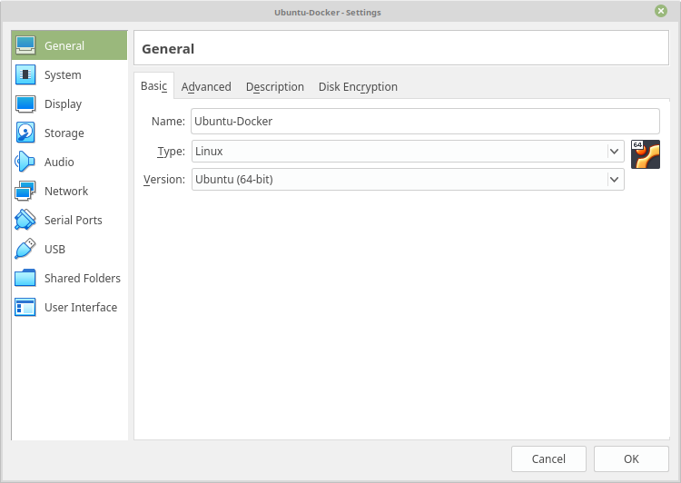
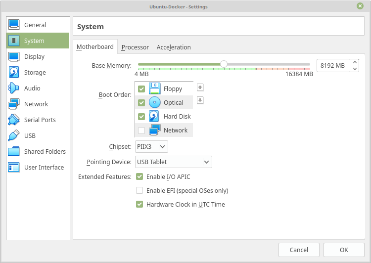
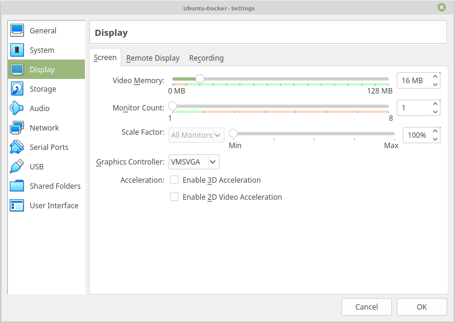
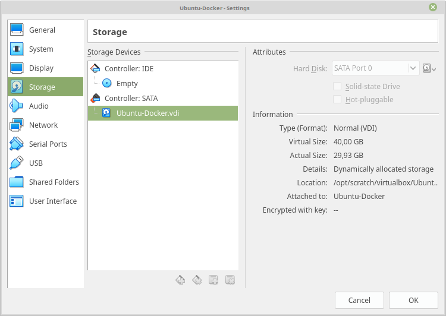
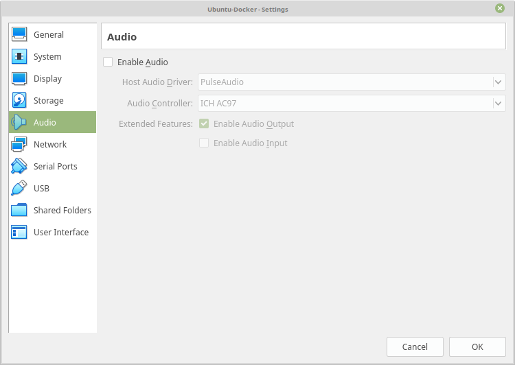
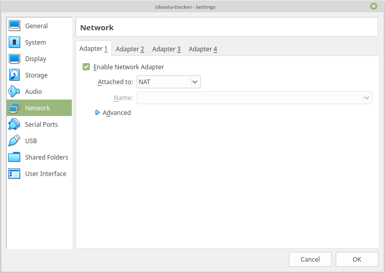
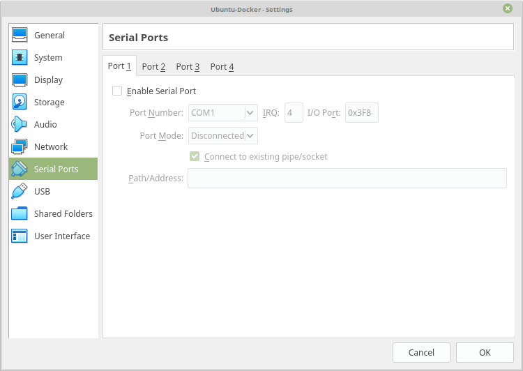
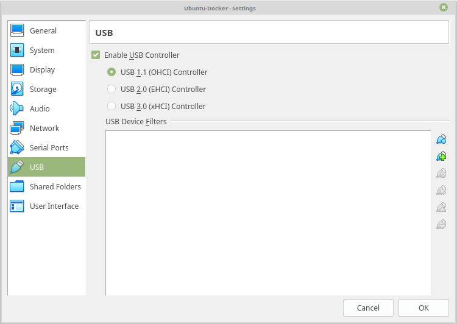
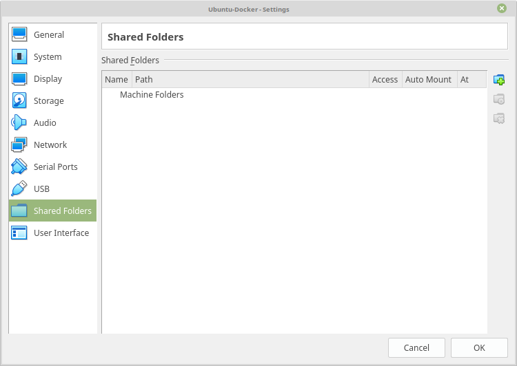
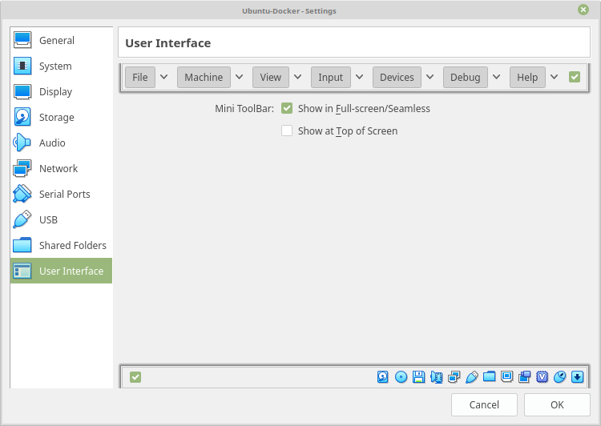

# Ubuntu Docker VirtualBox Virtual Machine image

## Overview
`Ubuntu-Docker`is a VirtualBox virtual machine image created using ISO image `xubuntu-18.04.2-desktop-amd64.iso`.

The image contains the following key software:

| Software | Version | Purpose |
| ------------- | ------------- | ------------- |
| [Xubuntu](https://xubuntu.org/) | xubuntu-18.04.2-desktop-amd64 | Base Linux installation |
| [Docker](https://www.docker.com/) | Docker version 18.09.6, build 481bc77 | Performs operating-system-level virtualization |
| [Docker Compose](https://docs.docker.com/compose/) | docker-compose version 1.24.0, build 0aa59064 | Tool for defining and running multi-container Docker applications |
| [OpenJDK](https://openjdk.java.net/) | openjdk version 1.8.0_191 | A free and open-source implementation of the Java Platform, Standard Edition |
| [Apache Maven](https://maven.apache.org/) | Apache Maven 3.6.1 | A build automation tool used primarily for Java projects. Maven addresses two aspects of building software: first, it describes how software is built, and second, it describes its dependencies |
| [Gradle Build Tool](https://gradle.org/) | Gradle 5.4.1 | An open-source build automation system that builds upon the concepts of Apache Ant and Apache Maven and introduces a Groovy-based domain-specific language instead of the XML form used by Apache Maven for declaring the project configuration |

## Virtual Machine configuration
The Virtual Machine has been configured using the following settings.

| Setting | key | Value |
| ------------- | ------------- | ------------- |
| Logon username | User | **user** |
| Logon password | Password | **password** |
| System -> Motherboard | Base memory | 8192 MB |
| System -> Processor | Processor(s) | 1 CPU |
| Storage | SATA Contoller | `Ubuntu-Docker.vdi` (Virtual Size: 40,00 GB, Dynamically allocated storage) |
| Network -> Adapter 1 | Attached to: | NAT |
| USB | Enable USB Controller | USB 1.1 (OHCI) Controller |


*General Settings*



*System Settings*



*Display Settings*



*Storage Settings*



*Audio Settings*



*Network Settings*



*Serial Ports Settings*



*USB Settings*



*Shared Folders Settings*



*User Interface Settings*



## Virtual Machine software installation
Software and environment configuration has been performed using the [install.sh](../scripts/install.sh) script.

Installation steps are provided below:

```bash
#!/bin/bash

#################################################
# Installation script to prepare pre-requistes for
# elastic-central-logging project on Ubuntu 18.X
#################################################

# declare global variables
DEVEL_DIR=/opt/devel
DISTRIB_DIR=/opt/devel/distrib
SOURCE_DIR=/opt/devel/source
TOOLS_DIR=/opt/devel/tools

ATOM_BINARY_URL="https://github.com/atom/atom/releases/download/v1.36.1/atom-amd64.deb"
MAVEN_BINARY_URL="http://apache.rediris.es/maven/maven-3/3.6.1/binaries/apache-maven-3.6.1-bin.tar.gz"
GRADLE_BINARY_URL="https://services.gradle.org/distributions/gradle-5.4.1-bin.zip"
CHROME_BINARY_URL="https://dl.google.com/linux/direct/google-chrome-stable_current_amd64.deb"
FAKESMTP_BINARY_URL="http://nilhcem.github.com/FakeSMTP/downloads/fakeSMTP-latest.zip"

ATOM_BINARY_FILE=atom-amd64.deb
MAVEN_BINARY_FILE=apache-maven-3.6.1-bin.tar.gz
GRADLE_BINARY_FILE=gradle-5.4.1-bin.zip
CHROME_BINARY_FILE=google-chrome-stable_current_amd64.deb
FAKESMTP_BINARY_FILE=fakeSMTP-latest.zip

MAVEN_EXTRACTED_DIR=apache-maven-3.6.1
GRADLE_EXTRACTED_DIR=gradle-5.4.1
FAKESMTP_EXTRACTED_DIR=fakeSMTP-2.0.jar

CENTRAL_LOGGING_PROJECT_URL="https://github.com/damianmcdonald/elastic-central-logging/archive/1.0.2-RELEASE.tar.gz"
CENTRAL_LOGGING_PROJECT_BINARY_FILE=1.0.2-RELEASE.tar.gz
CENTRAL_LOGGING_PROJECT_EXTRACTED_DIR=elastic-central-logging-1.0.2-RELEASE
CENTRAL_LOGGING_PROJECT_PREFERRED_NAME=elastic-central-logging

# create base directories
sudo mkdir -p $DEVEL_DIR
sudo mkdir -p $DISTRIB_DIR
sudo mkdir -p $SOURCE_DIR
sudo mkdir -p $TOOLS_DIR

sudo chown -R ${USER} $DEVEL_DIR
sudo chgrp -R ${USER} $DEVEL_DIR
sudo chmod -R 775 $DEVEL_DIR

# prepare ubuntu
sudo apt update
sudo apt -y upgrade
sudo apt -y dist-upgrade

# install pre-requisites
sudo apt -y install python3 unzip build-essential dkms linux-headers-$(uname -r) apt-transport-https ca-certificates curl wget software-properties-common openjdk-8-jdk ncftp git

# install and configure docker
curl -fsSL https://download.docker.com/linux/ubuntu/gpg | sudo apt-key add -
sudo add-apt-repository "deb [arch=amd64] https://download.docker.com/linux/ubuntu bionic stable"
sudo apt update
sudo apt -y install docker-ce
sudo usermod -aG docker ${USER}
sudo cp -v /etc/sysctl.conf /etc/sysctl.conf.backup
echo "#### Added to increase memory for Docker" | sudo tee -a /etc/sysctl.conf
echo "vm.max_map_count=262144" | sudo tee -a /etc/sysctl.conf

# install and configure docker-compose
sudo curl -L "https://github.com/docker/compose/releases/download/1.24.0/docker-compose-$(uname -s)-$(uname -m)" -o /usr/local/bin/docker-compose
sudo chmod +x /usr/local/bin/docker-compose

# grab and install tools

## install atom
cd $DISTRIB_DIR
wget $ATOM_BINARY_URL
sudo dpkg -i $ATOM_BINARY_FILE
sudo apt -y install -f

## install maven
cd $DISTRIB_DIR
wget $MAVEN_BINARY_URL
tar xvzf $MAVEN_BINARY_FILE
mv -v $DISTRIB_DIR/$MAVEN_EXTRACTED_DIR $TOOLS_DIR/$MAVEN_EXTRACTED_DIR
sudo touch /etc/profile.d/maven.sh
echo "# Define M2_HOME" | sudo tee -a /etc/profile.d/maven.sh
echo "export M2_HOME=$TOOLS_DIR/$MAVEN_EXTRACTED_DIR" | sudo tee -a /etc/profile.d/maven.sh
echo "export PATH=\$PATH:/\$M2_HOME/bin" | sudo tee -a /etc/profile.d/maven.sh

## install gradle
cd $DISTRIB_DIR
wget $GRADLE_BINARY_URL
unzip $GRADLE_BINARY_FILE
mv -v $DISTRIB_DIR/$GRADLE_EXTRACTED_DIR $TOOLS_DIR/$GRADLE_EXTRACTED_DIR
sudo touch /etc/profile.d/gradle.sh
echo "# Define GRADLE_HOME" | sudo tee -a /etc/profile.d/gradle.sh
echo "export GRADLE_HOME=$TOOLS_DIR/$GRADLE_EXTRACTED_DIR" | sudo tee -a /etc/profile.d/gradle.sh
echo "export PATH=\$PATH:/\$GRADLE_HOME/bin" | sudo tee -a /etc/profile.d/gradle.sh

## install chrome
cd $DISTRIB_DIR
wget $CHROME_BINARY_URL
sudo dpkg -i $CHROME_BINARY_FILE
sudo apt -y install -f

## install fakesmtp
cd $DISTRIB_DIR
wget $FAKESMTP_BINARY_URL
unzip $FAKESMTP_BINARY_FILE
mkdir -p $TOOLS_DIR/fakesmtp
mv -v $DISTRIB_DIR/$FAKESMTP_EXTRACTED_DIR $TOOLS_DIR/fakesmtp/$FAKESMTP_EXTRACTED_DIR

# grab project source code
cd $DISTRIB_DIR
wget $CENTRAL_LOGGING_PROJECT_URL
tar xvzf $CENTRAL_LOGGING_PROJECT_BINARY_FILE
mv $DISTRIB_DIR/$CENTRAL_LOGGING_PROJECT_EXTRACTED_DIR $SOURCE_DIR/$CENTRAL_LOGGING_PROJECT_PREFERRED_NAME

# clean up distrib folder
rm -f $DISTRIB_DIR/*

# reset permissions
sudo chown -R ${USER} $DEVEL_DIR
sudo chgrp -R ${USER} $DEVEL_DIR
sudo chmod -R 775 $DEVEL_DIR

```
